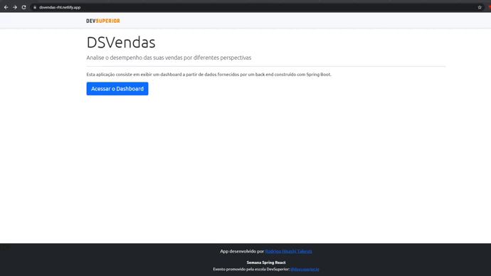

# Projeto app do Bootcamp Spring React com integração do Front e do Back-end

## Descrição do Projeto 📁

 Criação de um app com o front-end (dashboard) com a comunicação com o back-end (banco de dados).

## Tecnologias usadas  👨‍💻
Esse projeto foi desenvolvido com as seguintes tecnologias e ferramentas:
- Java ( Spring Boot /  JPA / Hibernate / Maven )
- HTML
- CSS
- Typescript
- React
- Bootstrap
- PostgreSQL
- Postman
- Git
- Heroku
- Netlify

## Índice

<!--ts-->
   * [Modelos](#Modelos)
      * [Modelo Conceitual](#Modelo-Conceitual)
      * [Padrão camadas adotado](#Padrão-camadas-adotado)
   * [Front-end](#Front-end) 
   * [Back-end](#Back-end)
<!--te-->

## Modelos

#### Modelo Conceitual

#### Padrão camadas adotado

## Front-end

O app online pode ser encontrado nesse link: https://dsvendas-rht.netlify.app/dashboard

## Back-end
O back-end foi feito em Java Spring Boot com conexão com o banco de dados PostgreSQL. Está hospedado no app Heroku: 

Sellers -> https://sds4-rodrigo.herokuapp.com/sellers
Sales -> https://sds4-rodrigo.herokuapp.com/sales
Amount-by-seller -> https://sds4-rodrigo.herokuapp.com/sales/amount-by-seller
Success-by-seller ->https://sds4-rodrigo.herokuapp.com/sales/success-by-seller